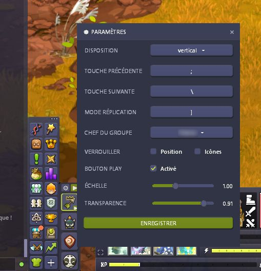
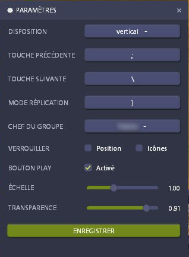

# Dofus MultiCompte Enhancer

[](https://github.com/silverspy/Dofus-MultiCompte-Enhancer/actions/workflows/windows-build.yml)
[](https://github.com/silverspy/Dofus-MultiCompte-Enhancer/releases/latest)

[Français](#français) · [English](#english)

<p align="center">
  
</p>

## Français

**Dofus MultiCompte Enhancer** est un compagnon Windows compact conçu pour simplifier la gestion d'une équipe multi-compte. Sa barre flottante s'intègre visuellement à l'interface de Dofus et regroupe le lancement des comptes, la navigation entre les personnages, la création du groupe et la réplication des actions dans un seul outil discret.

### Fonctions principales

| | Fonction | Description |
|:--:|---|---|
| 🚀 | **Lancement automatisé** | Ouvre Ankama Launcher, démarre les quatre fenêtres attendues et clique uniquement lorsque les boutons `JOUER` sont réellement disponibles. |
| 👥 | **Création du groupe** | Identifie les personnages par OCR, envoie les invitations depuis le chef, les accepte et revient automatiquement sur le chef du groupe. |
| ⚡ | **Navigation instantanée** | Passe d'une fenêtre Dofus à l'autre avec des raccourcis clavier, boutons de souris ou molette entièrement configurables. |
| 🪞 | **Réplication des actions** | Reproduit à la demande les clics, leurs positions proportionnelles, les déplacements, la molette et les frappes clavier sur les autres fenêtres. |
| 👑 | **Équipe toujours lisible** | Place le chef en premier, affiche sa couronne et indique immédiatement quel personnage est au premier plan. |
| 🎨 | **Interface intégrée** | Propose une disposition verticale ou horizontale, des icônes de classe, une échelle et une transparence réglables dans un style proche de Dofus. |
| 🔒 | **Contrôles personnalisables** | Permet de verrouiller la position ou les icônes, de masquer le bouton Play et de conserver automatiquement tous les réglages. |
| 🌍 | **Interface bilingue** | L'application peut être utilisée en français ou en anglais depuis le menu des paramètres. |

<p align="center">
  
  &nbsp;&nbsp;&nbsp;
  
</p>

### Télécharger

Téléchargez l'exécutable Windows prêt à l'emploi depuis la [dernière Release](https://github.com/silverspy/Dofus-MultiCompte-Enhancer/releases/latest).

Aucune installation de Python n'est nécessaire. Windows peut afficher un avertissement SmartScreen, car l'exécutable n'est pas signé numériquement.

Les réglages et les personnages détectés sont enregistrés dans :

```text
%LOCALAPPDATA%\Dofus MultiCompte Enhancer
```

### Développement et publication

Prérequis : Windows et Python 3.12 ou plus récent.

```powershell
python -m venv .venv
.\.venv\Scripts\Activate.ps1
python -m pip install -r requirements-dev.txt
python -m pytest -q
python -m PyInstaller --noconfirm --clean Dofus-MultiCompte-Enhancer.spec
```

L'exécutable est généré dans `dist\Dofus-MultiCompte-Enhancer.exe`. La pipeline Windows construit également un artefact à chaque changement ciblant `main` et publie automatiquement une Release lors de l'envoi d'un tag `v*`.

---

## English

**Dofus MultiCompte Enhancer** is a compact Windows companion designed to make multi-account team management effortless. Its floating toolbar blends into the Dofus interface and brings account startup, character switching, group creation, and action mirroring together in one discreet tool.

### Main features

| | Feature | Description |
|:--:|---|---|
| 🚀 | **Automated startup** | Opens Ankama Launcher, starts the four expected windows, and clicks `PLAY` only when each button is genuinely ready. |
| 👥 | **Automatic group creation** | Identifies characters through OCR, sends invitations from the leader, accepts them, and returns to the group leader. |
| ⚡ | **Instant window switching** | Moves between Dofus windows using fully configurable keyboard, mouse-button, or wheel shortcuts. |
| 🪞 | **Action mirroring** | Optionally mirrors clicks, proportional positions, pointer movement, scrolling, and keyboard input across the other windows. |
| 👑 | **Readable team state** | Keeps the leader first, displays a crown, and immediately highlights the character currently in the foreground. |
| 🎨 | **Integrated interface** | Offers vertical and horizontal layouts, class icons, scaling, and opacity controls in a Dofus-inspired style. |
| 🔒 | **Customizable controls** | Locks the panel or character icons, hides the Play button when desired, and automatically preserves every setting. |
| 🌍 | **Bilingual interface** | Switches the application between French and English directly from the settings panel. |

### Download

Download the ready-to-run Windows executable from the [latest Release](https://github.com/silverspy/Dofus-MultiCompte-Enhancer/releases/latest).

Python is not required for the released executable. Windows may display a SmartScreen warning because the binary is not code-signed.

Settings and detected characters are stored in:

```text
%LOCALAPPDATA%\Dofus MultiCompte Enhancer
```

### Development and releases

Requirements: Windows and Python 3.12 or newer.

```powershell
python -m venv .venv
.\.venv\Scripts\Activate.ps1
python -m pip install -r requirements-dev.txt
python -m pytest -q
python -m PyInstaller --noconfirm --clean Dofus-MultiCompte-Enhancer.spec
```

The executable is generated at `dist\Dofus-MultiCompte-Enhancer.exe`. The Windows pipeline also builds an artifact for every change targeting `main` and automatically publishes a Release when a `v*` tag is pushed.

## Avertissement / Disclaimer

Projet communautaire non affilié à Ankama. L'utilisateur reste responsable du respect des conditions d'utilisation du jeu.

This is an unofficial community project and is not affiliated with Ankama. Users remain responsible for complying with the game's terms of service.
